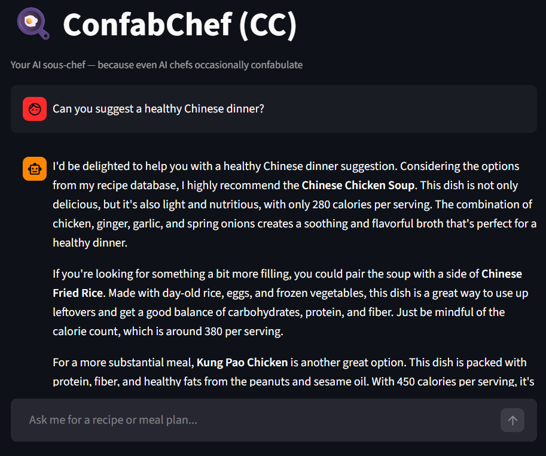

# 🍳 ConfabChef (CC)

> Your AI sous-chef — because even AI chefs occasionally confabulate.

ConfabChef is a RAG-based (Retrieval-Augmented Generation) recipe and meal planning chatbot built with LangChain, Groq, and Streamlit. It retrieves relevant recipes from a local knowledge base and generates personalised meal suggestions using a large language model. It can also fetch current supermarket deals from your local area and suggest recipes based on what's on sale this week.

## Demo



## How It Works

1. **Ingest** — Recipe documents are loaded, split into chunks and embedded into a FAISS vector index
2. **Retrieve** — User questions are matched against the vector index to find relevant recipes
3. **Generate** — A Groq LLM generates a personalised response based on the retrieved recipes
4. **Deals** *(optional)* — Fetches current supermarket offers via kaufda.de and uses them as additional context for meal planning

## Tech Stack

| Component | Technology |
| --- | --- |
| LLM | Groq (LLaMA 3.3 70B) |
| Orchestration | LangChain |
| Vector Store | FAISS |
| Embeddings | ibm-granite/granite-embedding-278m-multilingual |
| UI | Streamlit |
| Language | Python 3.12 |

## Project Structure

```text
ConfabChef/
├── src/
│   ├── ingest.py       # Load recipes & build FAISS index
│   ├── retriever.py    # Load FAISS index & retrieve relevant recipes
│   ├── chat.py         # LLM chain with RAG prompt + AI filter for non-food items
│   ├── offers.py       # Supermarket deal fetching & caching
│   ├── scrapper.py     # kaufda.de scraper
├── data/
│   ├── json/           # Cached weekly supermarket deals
│   └── recipes/        # Custom recipe knowledge base (.txt files)
│        └── recipes_db.csv  # Recipe database (Kaggle dataset)
├── app.py              # Streamlit UI
├── .env                # API keys (not committed)
└── requirements.txt
```

## Getting Started

### 1. Clone the repo

```bash
git clone https://github.com/YutingXia006/ConfabChef.git
cd ConfabChef
```

### 2. Create virtual environment

```bash
python -m venv venv
venv\Scripts\activate
pip install -r requirements.txt
```

### 3. Set up `.env`

GROQ_API_KEY=your_key_here
Optional — needed for supermarket deals feature
MARKETS=Lidl,EDEKA
LAT=your_latitude
LNG=your_longitude

### 4. Run the app

```bash
streamlit run app.py
```

The app automatically checks for a FAISS index at `data/faiss_index` and builds one on first launch. If you add or update recipes, delete the index folder and restart the app or run:

```bash
python src/ingest.py
```

## Features

**Recipe & Meal Planning**
Ask for recipes, weekly meal plans, or ingredient-based suggestions. Specify dietary restrictions, calorie goals, allergies, or cuisine preferences directly in the chat.

**Supermarket Deals Integration**
Click "🛒 Use this week's supermarket deals" to fetch current offers from your local supermarkets via kaufda.de. Deals are cached weekly as JSON so the scraper only runs once per week.

**Multilingual**
Responds in the same language as the user thanks to the multilingual embedding model and Groq LLM.

## Adding Your Own Recipes

Add `.txt` files to `data/recipes/` in this format:\
Name: Your Recipe Name\
Cuisine: Chinese\
Servings: 2\
Calories: 300\
Ingredients:

ingredient 1\
ingredient 2

Instructions:

Step one\
Step two

Tags: tag1, tag2

Then delete `data/faiss_index` and restart the app or run `python src/ingest.py`.

## Author

Yuting Xia — [GitHub](https://github.com/YutingXia006) | [LinkedIn](https://www.linkedin.com/in/yuting-xia-89180a274/)

## Licence

MIT License — do whatever you want with it.

## Dataset

Recipe data sourced from [Collection of Recipes around the world](https://www.kaggle.com/datasets/prajwaldongre/collection-of-recipes-around-the-world) by Prajwal Dongre on Kaggle, licensed under [CC0: Public Domain](https://creativecommons.org/publicdomain/zero/1.0/).
