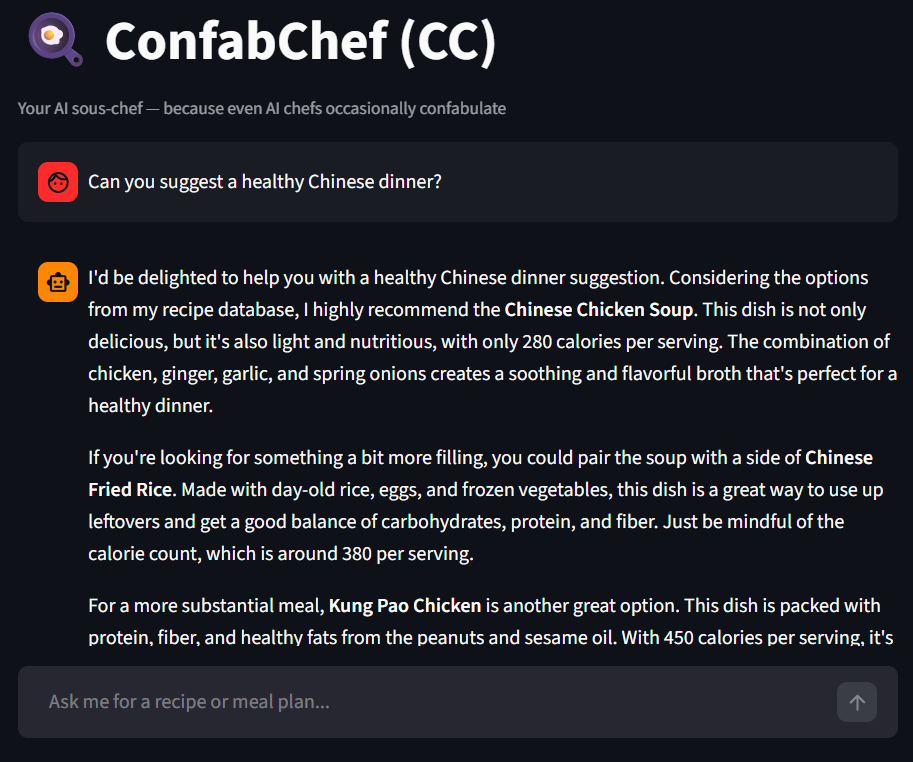
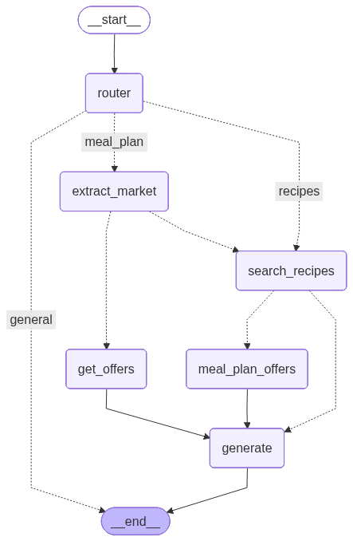

# 🍳 ConfabChef (CC)

> Your AI sous-chef — because even AI chefs occasionally confabulate.

ConfabChef is an agentic RAG-based recipe and meal planning chatbot built with LangGraph, LangChain, Groq, and Streamlit. A LangGraph agent intelligently routes your request, retrieves relevant recipes from a local knowledge base, and automatically fetches current supermarket deals — all from a single chat message.

## 🚀 Live Demo

[Try ConfabChef here](https://confabchef.streamlit.app/)



## How It Works

The app uses a LangGraph agent that decides how to handle each request:



1. **Route** — A fast LLM (LLaMA 3.1 8B) classifies the request into recipes, meal_plan, offers, or general
2. **Extract** — The agent extracts supermarket preferences directly from the message
3. **Retrieve** — Relevant recipes are fetched from a FAISS vector index
4. **Deals** — Current supermarket offers are fetched via kaufda.de (IP-based geolocation, cached weekly)
5. **Plan** — A creative planner generates a diverse meal plan without restrictions
6. **Refine** — A dietitian node applies dietary restrictions and substitutes forbidden ingredients

## Tech Stack

| Component | Technology |
| --- | --- |
| Agent | LangGraph |
| LLM (Generate) | Groq (LLaMA 3.3 70B) |
| LLM (Router) | Groq (LLaMA 3.1 8B) |
| Orchestration | LangChain |
| Vector Store | FAISS |
| Embeddings | ibm-granite/granite-embedding-278m-multilingual |
| UI | Streamlit |
| Language | Python 3.12 |
| Container | Docker |

## Project Structure

```text
ConfabChef/
├── src/
│   ├── agent.py        # LangGraph agent with routing logic
│   ├── ingest.py       # Load recipes & build FAISS index
│   ├── retriever.py    # Load FAISS index & retrieve relevant recipes
│   ├── offers.py       # Supermarket deal fetching & caching
│   ├── scraper.py      # kaufda.de scraper
├── data/
│   ├── json/           # Cached weekly supermarket deals
│   └── recipes/        # Custom recipe knowledge base (.txt files)
│        └── recipes_db.csv  # Recipe database (Kaggle dataset)
├── app.py              # Streamlit UI
├── .env                # API keys (not committed)
├── Dockerfile
├── docker-compose.yml
├── .env.example
└── requirements.txt
```

## Getting Started

### Option A — Docker (recommended)

1. Clone the repo
2. Set up environment variables (see `.env.example`)
3. Run:

```bash
docker compose up --build
```

App runs at `http://localhost:8501`

### Option B — Local (venv)

#### 1. Clone the repo

```bash
git clone https://github.com/YutingXia006/ConfabChef.git
cd ConfabChef
```

#### 2. Create virtual environment

```bash
python -m venv venv
venv\Scripts\activate
pip install -r requirements.txt
```

#### 3. Set up `.env`

GROQ_API_KEY=your_key_here\
That's it! No location or market configuration needed. kaufda.de detects your location automatically via IP geolocation.

#### 4. Run the app

```bash
streamlit run app.py
```

The app automatically checks for a FAISS index at `data/faiss_index` and builds one on first launch. If you add or update recipes, delete the index folder and restart the app or run:

```bash
python src/ingest.py
```

## Features

**🤖 Agentic Routing**
A LangGraph agent classifies each request and decides which tools to use — no manual buttons needed. Just chat naturally.

**🍳 Recipe & Meal Planning**
Ask for recipes or weekly meal plans with complex dietary requirements. A two-stage AI pipeline first creates a creative plan, then a dietitian refines it — substituting forbidden ingredients automatically (e.g. pork → beef, dairy → plant-based).

**🛒 Automatic Supermarket Deals**
Mention your preferred supermarket and CC automatically fetches this week's local deals via kaufda.de. Location is detected automatically via IP geolocation. Supported: Lidl, REWE, EDEKA, Penny, Netto Marken-Discount. Deals are cached weekly.

> *"I usually shop at Lidl, give me a weekly meal plan"*

**🌍 Multilingual**
Responds in the same language as the user thanks to the multilingual embedding model and Groq LLM.

## Adding Your Own Recipes

Add `.txt` files to `data/recipes/` in this format:\
Name: Your Recipe Name\
Cuisine: Chinese\
Servings: 2\
Calories: 300\
Ingredients:

ingredient 1\
ingredient 2

Instructions:

Step one\
Step two

Tags: tag1, tag2

Then delete `data/faiss_index` and restart the app or run `python src/ingest.py`.

## Author

Yuting Xia — [GitHub](https://github.com/YutingXia006) | [LinkedIn](https://www.linkedin.com/in/yuting-xia-89180a274/)

## Licence

MIT License — do whatever you want with it.

## Dataset

Recipe data sourced from [Collection of Recipes around the world](https://www.kaggle.com/datasets/prajwaldongre/collection-of-recipes-around-the-world) by Prajwal Dongre on Kaggle, licensed under [CC0: Public Domain](https://creativecommons.org/publicdomain/zero/1.0/).
